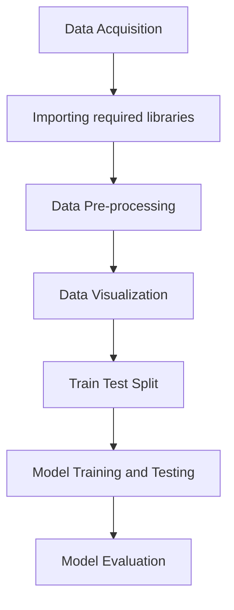

# Twitter-Sentiment-Analysis
Twitter Sentiment Analysis with Python using Natural Language Processing and Feature Extraction.

<h2 align='center'>WORKFLOW OF THE PROJECT </h2>

```mermaid
flowchart TD
A[Data Acquisition] --> B[Importing required libraries]
B[Importing required libraries] --> C[Data Pre-processing]
C[Data Pre-processing] --> D[Data Visualization]
D[Data Visualization] --> E[Train Test Split]
E[Train Test Split] --> F[Model Training and Testing]
F[Model Training and Testing] --> G[Model Evaluation]
```
